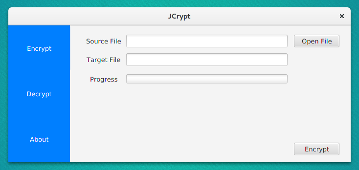

# JCrypt

[](https://www.codacy.com/app/hussain.derry/jcrypt?utm_source=github.com&utm_medium=referral&utm_content=HussainDerry/jcrypt&utm_campaign=badger)

Java file encryption utility

## Screenshots



## Requirements

* Java version 8 or newer.
* Java Cryptography Extension (*JCE*) Unlimited Strength Jurisdiction Policy.

## Usage

* Download the [latest version](dist/jcrypt-1.1.1.jar)

* Run the jar file using the following command:

  ```bash
  java -jar jcrypt-<VERSION>.jar
  ```

## License

```
Copyright 2017 Hussain Al-Derry

Licensed under the Apache License, Version 2.0 (the "License");
you may not use this file except in compliance with the License.
You may obtain a copy of the License at

   http://www.apache.org/licenses/LICENSE-2.0

Unless required by applicable law or agreed to in writing, software
distributed under the License is distributed on an "AS IS" BASIS,
WITHOUT WARRANTIES OR CONDITIONS OF ANY KIND, either express or implied.
See the License for the specific language governing permissions and
limitations under the License.
```
